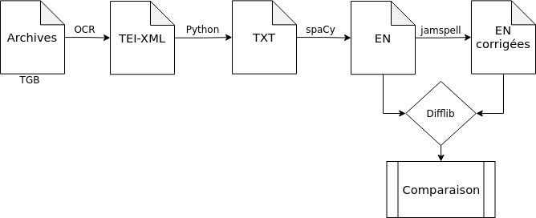

# corr_OCR_NER

Ce dépôt répertorie les données et les script pour l'évaluation de l'impact de la correction automatique du texte océrisé sur la tâche de reconnaissance d'entités nommées dans un corpus bruité.

# *Workflow* 

  

 

