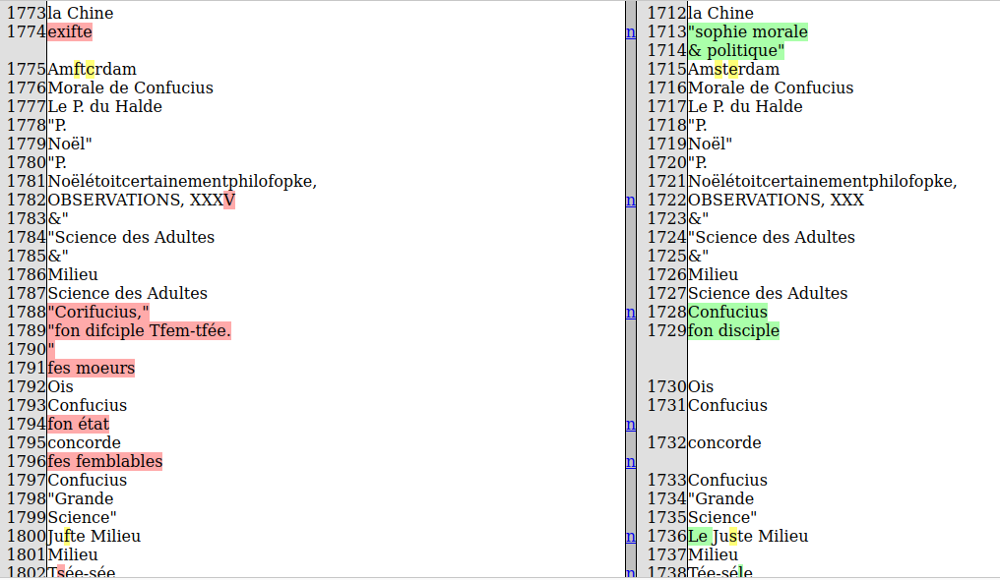

## Différences entre les EN avant et après la correction post-OCR

* Sortie HTML généré par la librairie [Difflib](https://docs.python.org/3/library/difflib.html) :

  * À gauche : les EN non corrigées

  * À droite : les EN corrigées

    

  * en rouge : suppressions

  * en jaune : substitutions

  * en vert : insertions

  

 

